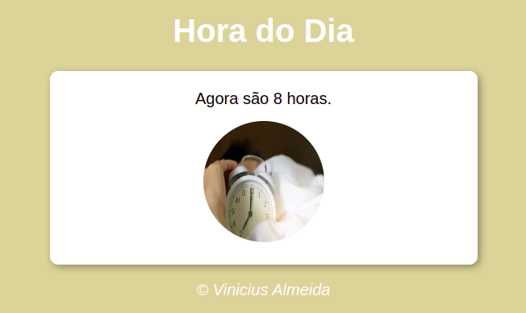

# Periodo do Dia
Desafio está em mudar imagens conforme o horário informado pelo sistema.
manhã, tarde e noite.

###  Links

- URL do site ao vivo: [https://viniciusmaranhao.github.io/projetoManha/]

## Tecnologias utilizadas

 
  
  
  

